# Blue-Green Deployment Assignment

This project demonstrates a complete blue-green deployment workflow for a Node.js user registration application. It includes a backend API, MongoDB, a blue/basic frontend, a green/enhanced frontend, Docker Compose for local container testing, and Kubernetes manifests for Minikube deployment.

The project was created and tested on a Windows local machine using Docker Desktop, Git Bash, MongoDB Compass, Minikube, and kubectl. The screenshots from `Screenshots.docx` have been extracted into the `screenshots/` folder and embedded in this README as proof of setup and testing.

## Repository

```bash
git clone https://github.com/yogeshvshinde/Blue-green-Deployment-assignment.git
cd Blue-green-Deployment-assignment
```

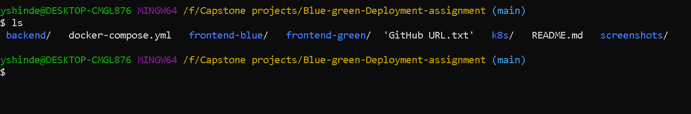

## Project Structure

```text
Blue-green-Deployment-assignment/
|-- backend/
|-- frontend-blue/
|-- frontend-green/
|-- k8s/
|-- screenshots/
|-- docker-compose.yml
|-- GitHub URL.txt
`-- README.md
```

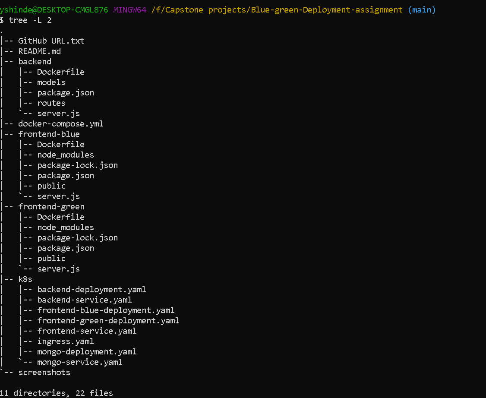

## Prerequisites

- Windows machine
- Docker Desktop
- Git Bash
- Node.js and npm
- MongoDB or MongoDB running through Docker
- MongoDB Compass, optional for visual database verification
- Minikube
- kubectl

## Application Components

- `backend`: Express API connected to MongoDB.
- `frontend-blue`: Basic user registration frontend, used as the blue deployment.
- `frontend-green`: Enhanced user registration frontend, used as the green deployment.
- `k8s`: Kubernetes manifests for MongoDB, backend, frontend blue, frontend green, frontend service, and ingress.

## Local Development

### Backend

Create `backend/.env`:

```env
PORT=5000
MONGO_URI=mongodb://localhost:27017/bluegreen
```

Run the backend:

```bash
cd backend
npm install
npm start
```

Verify the health endpoint:

```text
http://localhost:5000/health
```

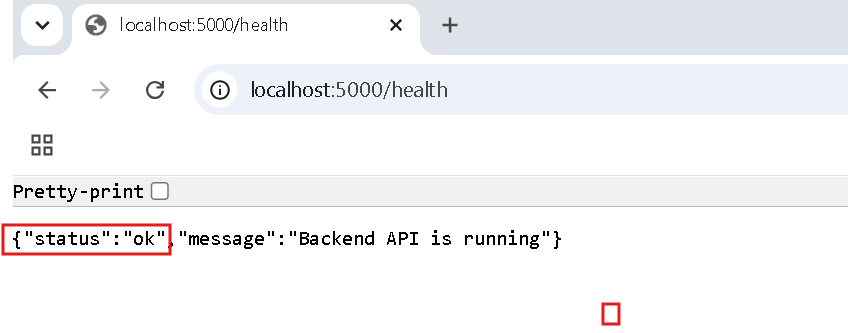

### MongoDB

For local testing, MongoDB was verified with MongoDB Compass at `localhost:27017` using the `bluegreen` database and `users` collection.

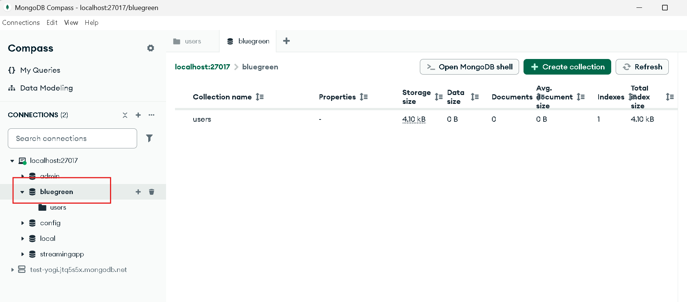

### Blue Frontend

```bash
cd frontend-blue
npm install
npm start
```

Open:

```text
http://localhost:3100
```

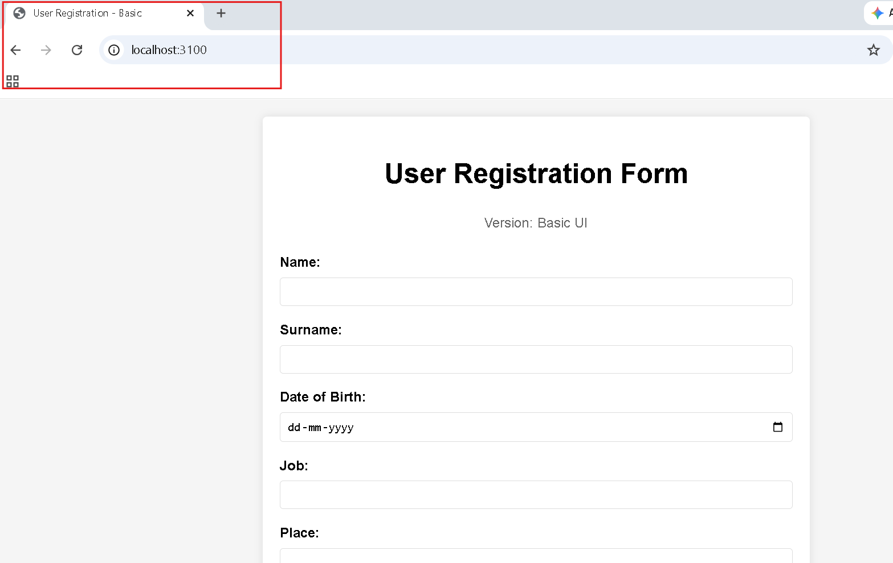

### Green Frontend

```bash
cd frontend-green
npm install
npm start
```

Open:

```text
http://localhost:3200
```

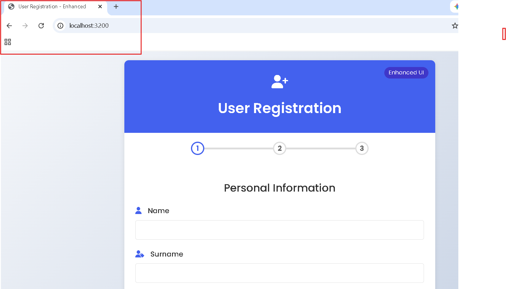

## Docker Compose Deployment

The repository includes `docker-compose.yml` for running MongoDB, backend, blue frontend, and green frontend together.

```bash
docker compose up -d --build
docker ps
```

Expected exposed ports:

| Service | Local Port |
| --- | --- |
| MongoDB | `27017` |
| Backend | `5000` |
| Blue frontend | `3100` |
| Green frontend | `3200` |

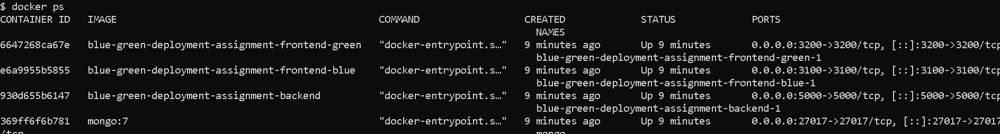

Stop the compose stack:

```bash
docker compose down
```

## Kubernetes Deployment With Minikube

Start Minikube:

```bash
minikube start
```

When using local images with Minikube from Git Bash, point Docker commands to Minikube's Docker daemon:

```bash
eval $(minikube docker-env)
```

For PowerShell, use:

```powershell
minikube -p minikube docker-env --shell powershell | Invoke-Expression
```

Build images inside the Minikube Docker environment:

```bash
docker build -t backend:v1 ./backend
docker build -t frontend-blue:v1 ./frontend-blue
docker build -t frontend-green:v1 ./frontend-green
```

Apply all Kubernetes manifests:

```bash
kubectl apply -f k8s/
```

Verify resources:

```bash
kubectl get pods
kubectl get deployments
kubectl get services
```

The frontend service is exposed as a NodePort:

```bash
kubectl describe svc frontend-service
```

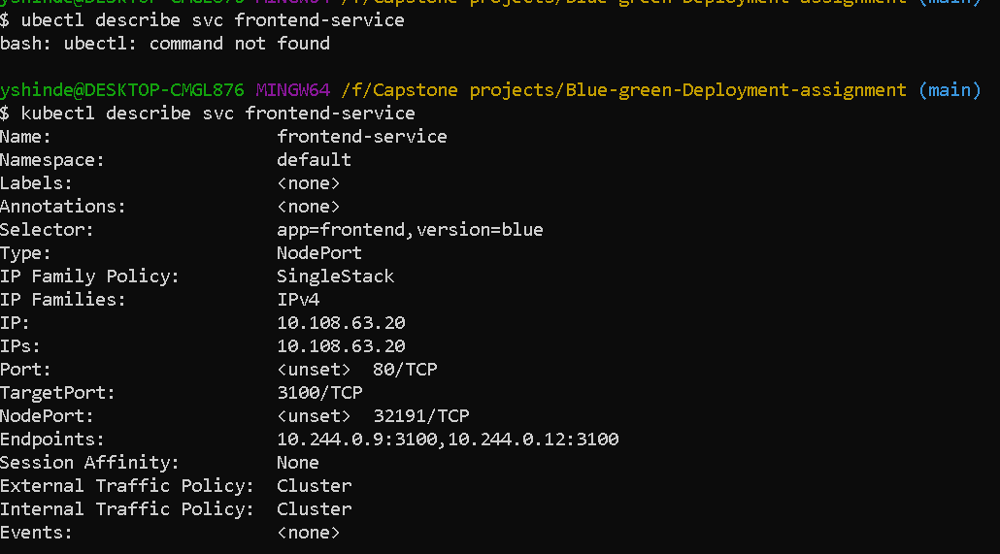

Open the application through Minikube:

```bash
minikube service frontend-service
```

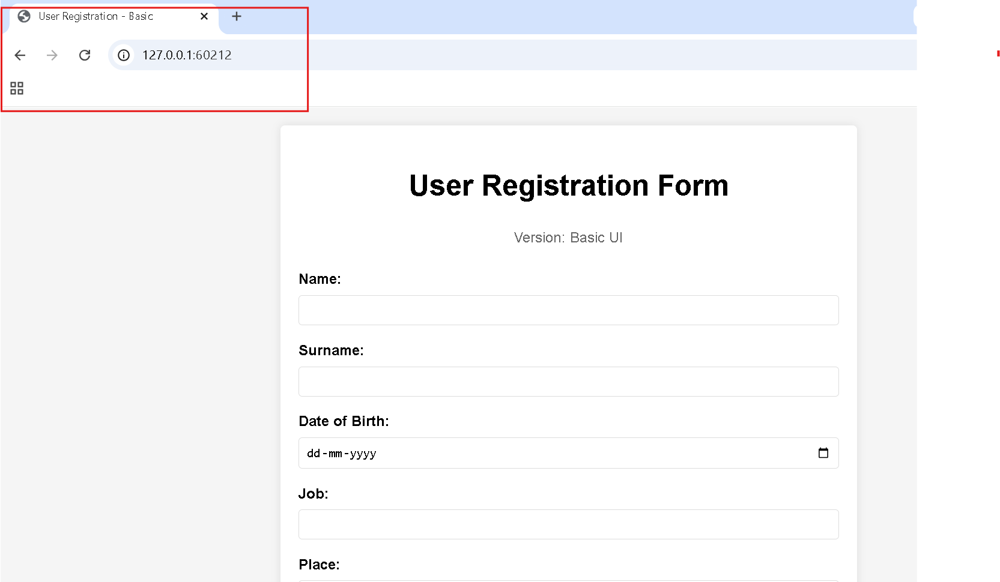

## Blue-Green Deployment Strategy

Blue-green deployment keeps two frontend versions available:

- Blue: current stable/basic frontend.
- Green: new enhanced frontend.

The Kubernetes `frontend-service` controls which version receives traffic through its selector.

Initial selector in `k8s/frontend-service.yaml`:

```yaml
selector:
  app: frontend
  version: blue
```

Switch traffic to green:

```bash
kubectl patch service frontend-service -p '{"spec":{"selector":{"app":"frontend","version":"green"}}}'
```

Verify the switch:

```bash
kubectl describe svc frontend-service
```

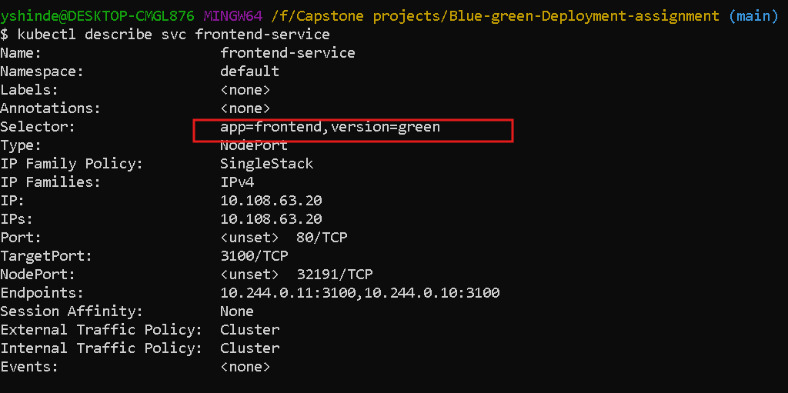

Open the service again:

```bash
minikube service frontend-service
```

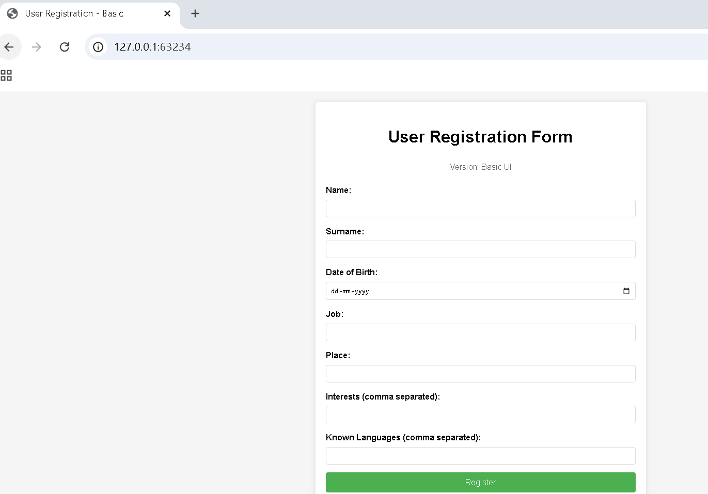

Rollback traffic to blue:

```bash
kubectl patch service frontend-service -p '{"spec":{"selector":{"app":"frontend","version":"blue"}}}'
```

### Port Alignment Note

For a pure selector-only blue-green switch, both frontend versions should listen on the same container port behind the same service `targetPort`. In this repository, blue uses port `3100` and green uses port `3200` for local development. If keeping those different container ports in Kubernetes, update the service `targetPort` during the green switch, or standardize both Kubernetes frontend containers to one shared app port.

Example combined patch for green when green listens on `3200`:

```bash
kubectl patch service frontend-service -p '{"spec":{"selector":{"app":"frontend","version":"green"},"ports":[{"port":80,"targetPort":3200}]}}'
```

Example combined rollback for blue:

```bash
kubectl patch service frontend-service -p '{"spec":{"selector":{"app":"frontend","version":"blue"},"ports":[{"port":80,"targetPort":3100}]}}'
```

## Kubernetes Files

The `k8s/` folder contains:

- `mongo-deployment.yaml`
- `mongo-service.yaml`
- `backend-deployment.yaml`
- `backend-service.yaml`
- `frontend-blue-deployment.yaml`
- `frontend-green-deployment.yaml`
- `frontend-service.yaml`
- `ingress.yaml`

## Useful Commands

```bash
kubectl get pods
kubectl get svc
kubectl get deployments
kubectl describe svc frontend-service
kubectl logs <pod-name>
kubectl delete -f k8s/
minikube stop
```

## Assignment Coverage

- Local application deployment completed.
- Backend connected to MongoDB and verified with `/health`.
- Blue and green frontend versions run locally.
- Dockerfiles and Docker Compose configuration created.
- Docker containers verified with `docker ps`.
- Kubernetes manifests created for Minikube.
- Blue-green service selector switching implemented and verified.
- Screenshots added as documentation evidence.

## License

This project is licensed under the MIT License.
